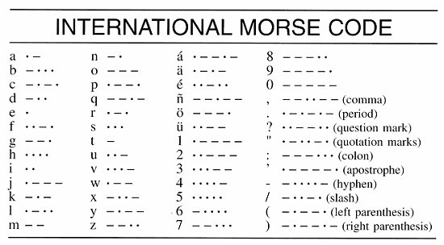

# Arduino Morse Code Player
This project plays a piece of text in Morse Code using a buzzer and an LED on an Arduino Uno board.

Currently, I have encoded all of the following characters:

`ABCDEFGHIJKLMNOPQRSTUVWXYZabcdefghijklmnopqrstuvwxyz0123456789,.?":'-/()`

## Required Components
- Arduino Uno (other boards should work)
- Buzzer
- LED
- 220Ω Resistor
- Breadboard
- 5 Jumper Wires
- USB A (male) to USB B (male) Cable
- [Arduino IDE](https://www.arduino.cc/en/software)

## Compile and Run
Setup the components according to the [Schematic](#schematic) below.

Next, open [morse_code_player.ino](morse_code_player/morse_code_player.ino) in the Arduino IDE. Please note, this file must be within a folder named "morse_code_player". At the top of the code, enter the text you want it to play and the Morse Code speed you want to it to use. Finally, connect your Arduino to your computer with the USB cable and press "Upload" in the IDE.

## Schematic

*Note: the buzzer symbol is not accurate so inspect your buzzer to connect the pins correctly.*

## Words Per Minute
This code measures its Morse Code speed in words per minute (WPM). This is the number of times the program can play the word `"PARIS "` (including the space at the end) in a minute. This is a standard measure.

## Testing
I have not set up any automated testing since this is a small project. However, the following testing is very comprehensive and should suffice.

#### Character Encoding Correctness
Test each acceptable character using the following string:

`"ABCDEFGHIJKLMNOPQRSTUVWXYZ abcdefghijklmnopqrstuvwxyz 0123456789 , . ? \" : ' - / ( )"`.

For the above string, please note that `\"` means `"` but the escape character is required in a C++ string.

Confirm that the buzzer and LED encode each character correctly. Refer to the following from [Merriam-Webster](https://www.merriam-webster.com/dictionary/Morse%20code):

#### WPM Accuracy
1. `"PARIS PARIS PARIS "` at 3WPM should take one minute.
2. `"PARIS PARIS PARIS PARIS PARIS PARIS PARIS "` at 7WPM should take one minute.
3. `"PARIS PARIS PARIS PARIS PARIS PARIS PARIS PARIS PARIS PARIS PARIS PARIS "` at 12WPM should take one minute.
4. `"PARIS PARIS PARIS PARIS PARIS PARIS PARIS PARIS PARIS PARIS PARIS PARIS PARIS PARIS PARIS PARIS PARIS PARIS PARIS PARIS PARIS "` at 21WPM should take one minute.
5. Run the above tests at a faster speed and adjust the expected time accordingly to complete the tests in less time. For example, "PARIS PARIS PARIS " at 9WPM should take 20 seconds. This is because we can multiply the speed by three and divide the expected time by three.

These WPM tests also ensure the program uses the correct timing for rests between dots and dashes, letters, and words.
